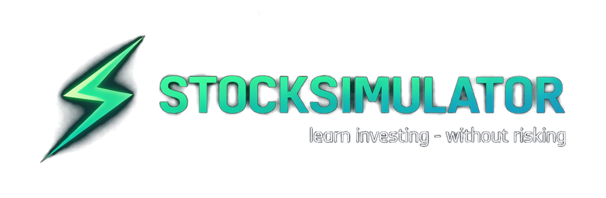

<a id="readme-top"></a>

<!-- PROJECT LOGO -->
<br />
<div align="center">
    
  </a>

  <h3 align="center">Stock Simulator</h3>

  <p align="center">
    <p><em>Learn investing — without risking</em></p>
    Probably the second best stock-trading simulator out there!
    </p>
</div>

<!-- TABLE OF CONTENTS -->
<details>
  <summary>Table of Contents</summary>
  <ol>
    <li>
      <a href="#about-the-project">About The Project</a>
      <ul>
        <li><a href="#built-with">Built With</a></li>
      </ul>
    </li>
    <li>
      <a href="#getting-started">Getting Started</a>
      <ul>
        <li><a href="#installation">Installation</a></li>
        <li><a href="#common-commands">Common commands</a></li>
      </ul>
    </li>
    <li><a href="#usage">Usage</a></li>
      <ul>
        <li><a href="#cli-mode-(single-command)">CLI mode (single command)</a></li>
        <li><a href="#portfolio-command">Portfolio command</a></li>
      </ul>
    <li><a href="#tests">Tests</a></li>
    <li><a href="#error-handling">Error handling</a></li>
    <li><a href="#snapshots">Snapshots</a></li>
    <li><a href="#continuous-integration-(github-actions)">Continuous Integration (GitHub Actions)</a></li>
    <li><a href="#roadmap">Roadmap</a></li>
    <li><a href="#project-structure">Project Structure</a></li>
    <li><a href="#who-did-what">Who did what</a></li>
    <li><a href="#contributing">Contributing</a></li>
    <li><a href="#license">License</a></li>
    <li><a href="#contact">Contact</a></li>
  </ol>
</details>

<!-- ABOUT THE PROJECT -->

## About The Project

StockSimulator is a Python-based trading simulator where users receive a virtual budget (e.g., 100,000 SEK) and can buy/sell stocks or cryptocurrencies using real market data. The project is designed to demonstrate object-oriented programming, API integration, data analysis, and visualization.

### Built With

**Backend**
* [![Python][Python]][Python-url]
* [![Flask][Flask]][Flask-url]
* [![Flask-CORS][Flask-CORS]][Flask-CORS-url]

**Data & Analytics**
* [![pandas][pandas]][pandas-url]
* [![Matplotlib][Matplotlib]][Matplotlib-url]
* [![yfinance][yfinance]][yfinance-url]
* [![pytz][pytz]][pytz-url]

**Quality**
* [![pytest][pytest]][pytest-url]

**Frontend**
* [![HTML5][HTML5]][HTML5-url]
* [![CSS3][CSS3]][CSS3-url]
* [![JavaScript][JavaScript]][JavaScript-url]


<p align="right">(<a href="#readme-top">back to top</a>)</p>

<!-- GETTING STARTED -->

## Getting Started

### Installation


1. **Clone the Repo**

   ```sh
   git clone <url>
   cd <project_map>
   ```

2. **Create virtual environment**
   Windows:

   ```sh
   python -m venv .venv
   source .venv\Scripts\activate
   ```

   MacOS/Linux:

   ```sh
   python3 -m venv .venv
   source .venv/bin/activate
   ```

   When venv is activated you will see (venv) in the prompt.

3. **Install dependencies**
   ```sh
   pip install -r requirements.txt
   ```

### Common commands

Run the web based mode with graph
```bash
start index.html
python api_server.py
```


Run the app (menu):

```bash
python -m src.main
```

Run a CLI command:

```bash
python -m src.main quote AAPL
python -m src.main buy AAPL 2
```

Run tests:
Run a CLI command:

```bash
pytest -q
```

<p align="right">(<a href="#readme-top">back to top</a>)</p>

<!-- USAGE EXAMPLES -->

## Usage

The app can run in three modes:

1. Interactive mode (menu + safe REPL loop)
2. CLI mode (single command via argparse)
3. Web based mode with graph

### Interactive mode (recommended)

From the project root:

```bash
python -m src.main
```

Inside the simulation:

- `help` or `?` shows available commands
- empty input does nothing (new prompt)
- unknown commands show a hint ("Type 'help' ...")

Example commands:

- `quote AAPL`
- `buy AAPL 5`
- `sell AAPL 2`
- `portfolio`
- `exit`

### CLI mode (single command)

You can run CLI commands either via the main entrypoint (recommended):

```bash
python -m src.main quote AAPL
python -m src.main buy AAPL 5
python -m src.main sell AAPL 2
```

Or directly via the CLI module:

```bash
python -m src.cli quote AAPL
python -m src.cli sell AAPL 2
python -m src.cli save
python -m src.cli load
```

Optional log level:

```bash
python -m src.main --log-level DEBUG quote AAPL
```

### Portfolio command

Show current portfolio status including cash, holdings, and total value.

```bash
python -m src.cli portfolio
```

<!-- ANALYTICS -->

### Analytics (Profit & Loss)

The analytics module calculates Profit/Loss (P/L) using a simple **average cost model**.

- **Realized P/L**: profit or loss from sold positions  
- **Unrealized P/L**: (latest price − average cost) × remaining quantity  
- **Total P/L**: realized + unrealized  

<p align="right">(<a href="#readme-top">back to top</a>)</p>

<!-- TESTS -->

## Tests

The project includes automated tests using **PyTest**.

### Running the tests

From the project root (`StockSimulator/`), with your virtual environment active:

```bash
pytest
```

or with more detailed output:

```bash
pytest -v
```
run a specific file:

```bash
pytest tests/test_transaction_manager.py
```

### Verification

The installation and run instructions have been tested on a fresh installation
using a clean virtual environment.

<p align="right">(<a href="#readme-top">back to top</a>)</p>

<!-- ERROR HANDLING -->

## Error Handling

The interactive simulation loop is designed to be stable and never crash on expected errors:

- **Input/validation errors** are caught and shown as a friendly message.
- **File errors** (e.g. unreadable or unwritable portfolio JSON) are caught and shown as a friendly message.
- **Market/API errors** when fetching quotes are caught and shown as a friendly message.
- For **unexpected exceptions**, the app logs a full stacktrace (ERROR) and prints:
  `Unexpected error occurred.`

### Transaction history

All buy and sell history saves automatically in  
`data/transactions.json` (JSON-list with append).

Example:

```json
[
  {
    "timestamp": "2026-02-03T13:45:12Z",
    "side": "BUY",
    "ticker": "ERIC-B.ST",
    "quantity": 20.0,
    "price": 95.0,
    "total": 1900.0,
    "cash_after": 8100.0
  }
]
```

<p align="right">(<a href="#readme-top">back to top</a>)</p>

## Snapshots
After each successful trade (buy/sell), a snapshot is appended to `data/snapshots.csv`.

## Continuous Integration (GitHub Actions)
This project uses GitHub Actions for Continuous Integration.
On every push and pull request, an automated pipeline is executed that:
- sets up Python
- installs dependencies from requirements.txt
- runs the full pytest test suite

A pull request can only be merged when the CI pipeline passes successfully.
The workflow definition can be found here:
`.github/workflows/python-tests.yml`
This ensures that the project remains stable and that all tests pass before changes are merged.

<!-- ROADMAP -->

## Roadmap

TBA

<!-- Project Structure -->

## Project Structure

```bash
StockSimulator/
├── css/                              # Frontend styles
│   └── styles.css                    # Main stylesheet
│
├── data/                             # Local app data (created/updated during usage)
│   ├── __init__.py                   # Allows data/ to be imported in tests/utilities
│   ├── portfolio.json                # Saved portfolio state
│   ├── snapshots.csv                 # Portfolio value history
│   ├── transactions.json             # Transaction history
│   └── yfinance_fetcher.py           # Legacy/alt Yahoo Finance fetch helper (used in tests)
│
├── docs/                             # Documentation assets
│   └── stocksimulator_logo.jpg       # Project logo used in README
│
├── docs/trello                       # Trello documentation (screenshots / planning exports)
│
├── js/                               # Frontend scripts
│   └── app.js                        # UI logic (actions, API calls, rendering)
│
├── src/                              # Core simulator modules
│   ├── __init__.py                   # Marks src as a package
│   ├── analytics.py                  # Performance calculations (P/L, summaries)
│   ├── assets.py                     # Asset/Stock domain objects (ticker/name/price metadata)
│   ├── cli.py                        # Argparse CLI commands (quote/sell) + portfolio JSON IO helpers
│   ├── config.py                     # Centralized paths (PROJECT_ROOT/DATA_DIR/SRC_DIR/TESTS_DIR)
│   ├── data_fetcher.py               # Market data layer (yfinance) + Quote model + QuoteFetchError codes
│   ├── errors.py                     # Controlled app error types (ValidationError/FileError)
│   ├── formatters.py                 # Output formatting helpers (money, tables, CLI/report strings)
│   ├── logger.py                     # Central logging setup (console + rotating file) + env initializer
│   ├── main.py                       # Entry point: menu + safe interactive loop + routes args to CLI
│   ├── portfolio.py                  # Portfolio domain model (cash/holdings + buy/sell + total_value)
│   ├── reporting.py                  # Report generation (human-readable summaries to file/console)
│   ├── snapshot_store.py             # Snapshot persistence (append/read snapshots.csv)
│   ├── transaction_logger.py         # Transaction persistence (append/read transactions.json)
│   ├── transaction_manager.py        # TransactionManager + domain exceptions + Transaction result model
│   ├── transactions.py               # Shared transaction types/models/helpers (side, totals, timestamps)
│   └── validators.py                 # Central input validation logic (tickers/amounts)
│
├── src/models                        # Domain models (typed data structures)
│   └── transaction.py                # Transaction model (timestamp, side, ticker, qty, price, totals)
│
├── tests/                            # Automated test suite (Pytest)
│   ├── conftest.py                   # Shared fixtures and test setup
│   ├── test_analytics.py             # Tests analytics calculations (P/L, summaries)
│   ├── stock_api.py                  # Test/dev utility for plotting snapshot data (chart helper)
│   ├── test_assets.py                # Tests asset/domain objects
│   ├── test_cli_quote.py             # CLI quote command tests (output/behavior)
│   ├── test_formatters.py            # Tests output formatting helpers
│   ├── test_logger.py                # Tests logging init + idempotency + log file creation
│   ├── test_main_dispatch.py         # Tests main routing/dispatch (menu/args → CLI actions)
│   ├── test_market_data.py           # Tests yfinance fetching + fetch_latest_quote error codes
│   ├── test_mock_prices.py           # Tests offline/mock pricing fallback behavior
│   ├── test_portfolio_persistence.py # Tests save/load portfolio JSON + file error handling
│   ├── test_portfolio.py             # Tests Portfolio behaviors (cash/holdings operations)
│   ├── test_report.py                # Tests report generation/output content
│   ├── test_snapshots_integration.py # Integration tests for snapshot writing after trades
│   ├── test_transaction_logger.py    # Tests transaction history persistence and structure
│   ├── test_transaction_manager.py   # Tests TransactionManager + domain validation/exceptions
│   └── test_validators.py            # Tests validators (tickers, amounts, edge cases)
│
├── api_server.py                     # Local backend server for the web UI (HTTP API endpoints)
├── index.html                        # Web UI entry point (loads css/js)
├── pytest.ini                        # Pytest configuration
├── README.md                         # Project documentation
└── requirements.txt                  # Python dependencies (pip install -r requirements.txt)
```

## Core Classes

- **Portfolio** (src/portfolio.py)  
  Represents the portfolio state including cash balance and holdings.

- **TransactionManager** (src/transaction_manager.py)  
  Handles buy and sell operations, validation, and transaction side effects.

- **SnapshotStore** (src/snapshot_store.py)  
  Persists portfolio snapshots after each trade.

<p align="right">(<a href="#readme-top">back to top</a>)</p>


<!-- CONTRIBUTING / WHO DID WHAT -->

## Who did what

Updated continuously. Primary sources are Trello cards (TR-xxx) and pull request history.

**Nahuel**

- TR-204: Cache and mock data fallback when market API fails  
  Modules: src/data_fetcher.py, src/config.py, data/mock_prices.json, related tests
- TR-242: Portfolio snapshots saved after each trade  
  Modules: src/snapshot_store.py, integration with TransactionManager, snapshot CSV persistence
- TR-253: Pytest JSON save and load roundtrip for portfolio persistence  
  Modules: portfolio save/load logic, tests using tmp_path
- TR-234: CLI command `portfolio` showing cash, holdings, and total value  
  Modules: src/cli.py, portfolio formatting and total value calculation
- TR-212: Core Portfolio class (cash, holdings, total_value)  
  Modules: src/portfolio.py
- TR-251: Pytest coverage for buy behavior (cash decreases, holdings increase)  
  Modules: tests/test_transaction_manager.py
- TR-263: README test instructions and CI/CD documentation  
  Documentation: README sections for pytest usage and GitHub Actions CI pipeline

**Nicklas (Scrum Master)**
- `src/transactions.py` — `TransactionManager` (buy/sell flow) *(TR-213, PR #29)*
- `src/cli.py` — robust error handling + `quote <TICKER>` *(TR-236, TR-231)*
- `src/portfolio.py` — save portfolio to JSON *(TR-221)*
- `src/reporting.py` — “today’s trading” report (summary, trades, P/L) *(TR-244)*
- `src/logger.py` — logging setup (console + file, trade logging) *(TR-104)*
- `tests/` — test: cannot sell more than holdings *(TR-252)*
- Fixes: timezone-aware UTC timestamps *(PR #28)*; prevent pytest writing to repo `data/` *(PR #37)*

**David**

**Anton**

**Alex**
- TR-102 venv + requirements.txt (yfinance,  pytest)
  README.md, requirements.txt
- TR-201 Data Fetcher: fetch current price for ticker via yfinance
  data/ __init__.py, yfinance_fetcher.py
  tests/ test_market_data.py
  pytest.ini
- TR-202 Data Fetcher: handle errors (invalid ticker, network error) + clear error messages
  src/data_fetcher.py
  tests/test_market_data.py
- TR-203 Exchange times (datetime): Blocks if the market is closed (different depending on the market)
  src/data_fetcher.py
  tests/test_transaction_manager.py
- TR-222 Robust loading of portfolio from JSON + autosave after every buy/sell
  src/portfolio.py
  tests/test_transaction_manager
- TR-223 Added transactions logging with failsafe
  src/models/transaction.py
  src/cli.py, transaction_logger.py, transaction_manager.py
  tests/test_portfolio.py, test_transaction_logger.py, test_transaction_manager.py
- TR-243 TradingView Charts: Real-time visualization of portfolio with interactive chart graph
  css/styles.css
  js/app.js
  tests/stock_sim_chart.py, test_transaction_logger.py, test_transaction_manager.py
  api_server.py
  index.html

<p align="right">(<a href="#readme-top">back to top</a>)</p>
    

<!-- LICENSE -->

## License

TBA

<p align="right">(<a href="#readme-top">back to top</a>)</p>

<!-- CONTACT -->

## Contact

| Name             | GitHub
| ---------------- | ---------------------------------------------------------- |
| Nahuel           | [@gonzycodes](https://https://github.com/gonzycodes) |
| Nicklas          | [@nicklasskoglund](https://github.com/nicklasskoglund) |
| Alex             | [@Zaitex89](https://https://github.com/Zaitex89) |
| Anton            | [@Aeontonn](https://github.com/Aeontonn) |
| David            | [@davidfjellstrom](https://github.com/davidfjellstrom) |


<!-- MARKDOWN LINKS & IMAGES -->
<!-- https://www.markdownguide.org/basic-syntax/#reference-style-links -->
[Python]: https://img.shields.io/badge/Python-3776AB?style=for-the-badge&logo=python&logoColor=white
[Python-url]: https://www.python.org/

[Flask]: https://img.shields.io/badge/Flask-000000?style=for-the-badge&logo=flask&logoColor=white
[Flask-url]: https://flask.palletsprojects.com/

[Flask-CORS]: https://img.shields.io/badge/Flask--CORS-000000?style=for-the-badge&logo=flask&logoColor=white
[Flask-CORS-url]: https://pypi.org/project/Flask-Cors/

[pandas]: https://img.shields.io/badge/pandas-150458?style=for-the-badge&logo=pandas&logoColor=white
[pandas-url]: https://pandas.pydata.org/

[Matplotlib]: https://img.shields.io/badge/Matplotlib-11557C?style=for-the-badge&logo=matplotlib&logoColor=white
[Matplotlib-url]: https://matplotlib.org/

[yfinance]: https://img.shields.io/badge/yfinance-000000?style=for-the-badge&logo=yahoo&logoColor=white
[yfinance-url]: https://pypi.org/project/yfinance/

[pytz]: https://img.shields.io/badge/pytz-1F6FEB?style=for-the-badge&logo=python&logoColor=white
[pytz-url]: https://pypi.org/project/pytz/

[pytest]: https://img.shields.io/badge/pytest-0A9EDC?style=for-the-badge&logo=pytest&logoColor=white
[pytest-url]: https://docs.pytest.org/

[HTML5]: https://img.shields.io/badge/HTML5-E34F26?style=for-the-badge&logo=html5&logoColor=white
[HTML5-url]: https://developer.mozilla.org/en-US/docs/Web/Guide/HTML/HTML5

[CSS3]: https://img.shields.io/badge/CSS3-1572B6?style=for-the-badge&logo=css3&logoColor=white
[CSS3-url]: https://developer.mozilla.org/en-US/docs/Web/CSS

[JavaScript]: https://img.shields.io/badge/JavaScript-F7DF1E?style=for-the-badge&logo=javascript&logoColor=000
[JavaScript-url]: https://developer.mozilla.org/en-US/docs/Web/JavaScript
