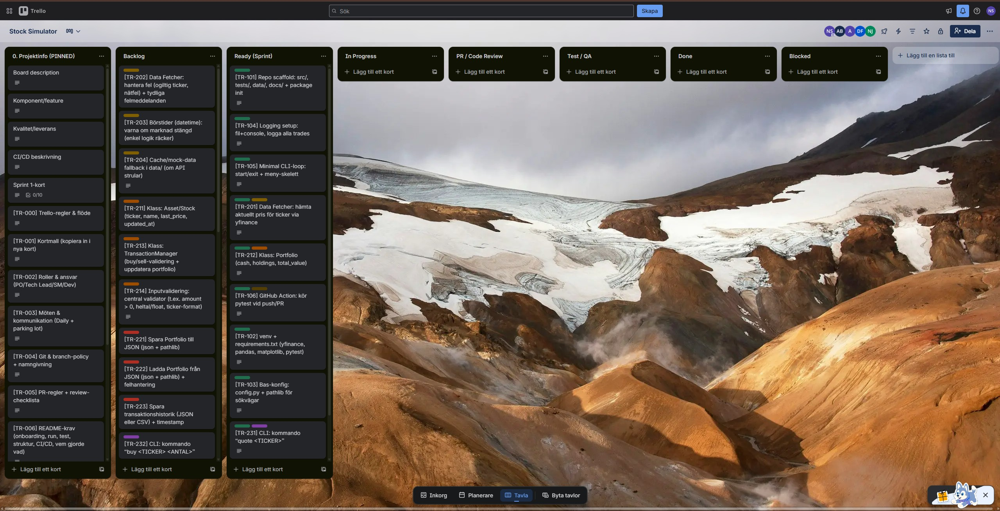
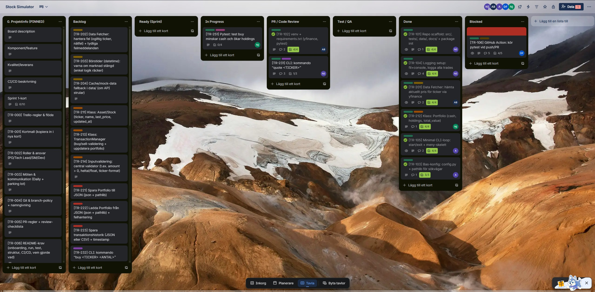
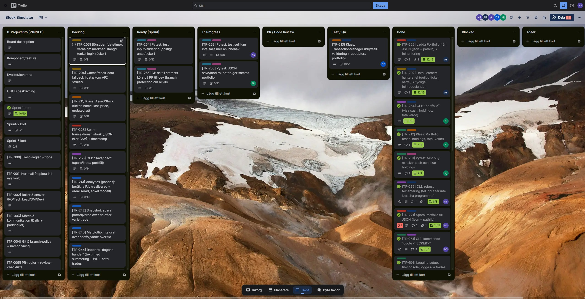
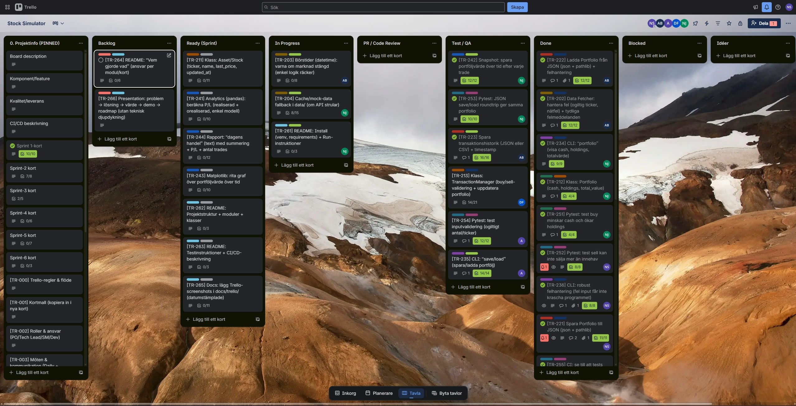
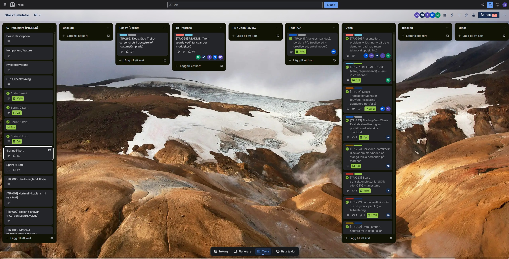

# Trello – process screenshots

Purpose: Document the project process (planning, sprint work, and completion) in a way that is easy to present during the final review/demo.

## Naming convention
- Filename format: `YYYY_MM_DD_<tag>.png`
- Example: `StockSimulator_2026_02_11_final.png`

## Screenshots (index)
| Date | File | Description |
|------|------|-------------|
| 2026-01-25 |  | Week 1 overview / early planning |
| 2026-01-27 |  | Sprint 1 board status |
| 2026-01-30 |  | Sprint 3 board status |
| 2026-02-04 |  | Sprint 5 board status |
| 2026-02-11 |  | Final board / wrap-up (Done) |

